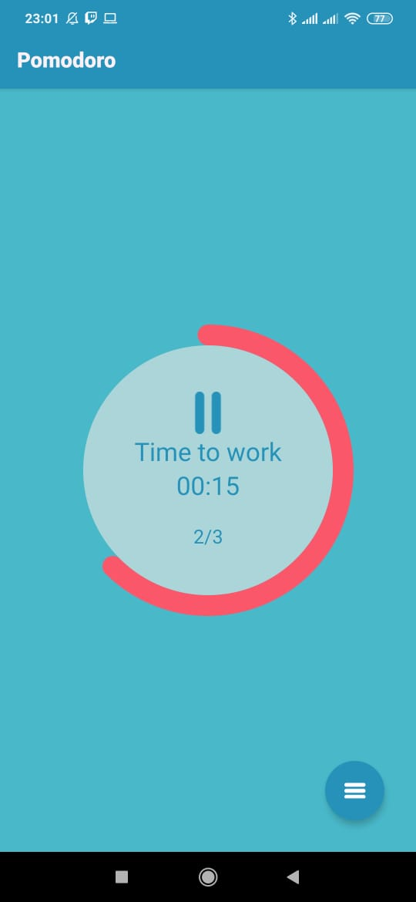
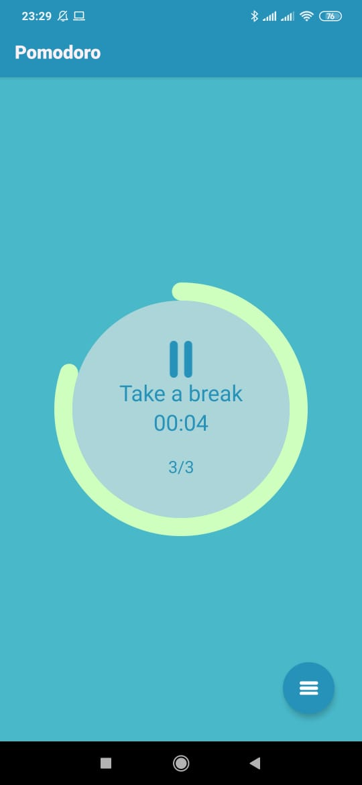
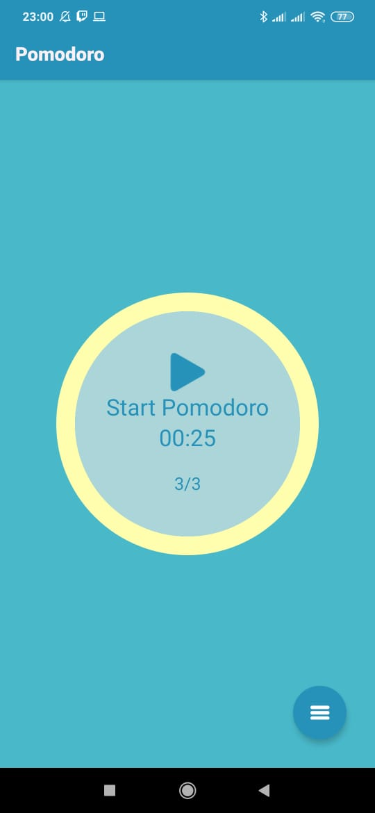
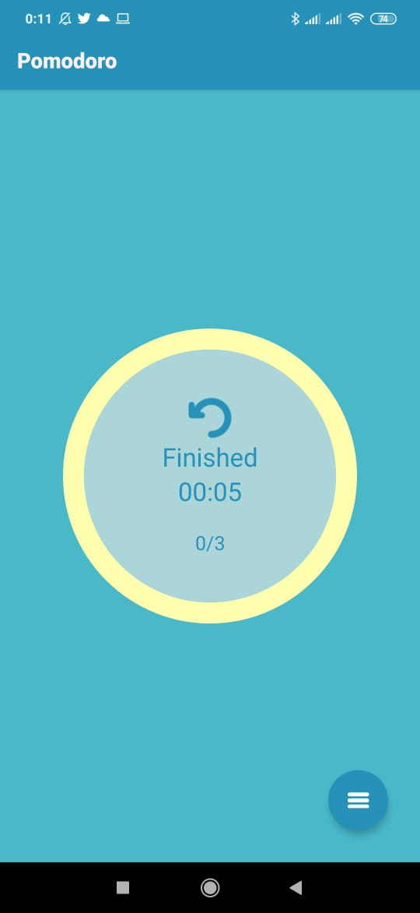
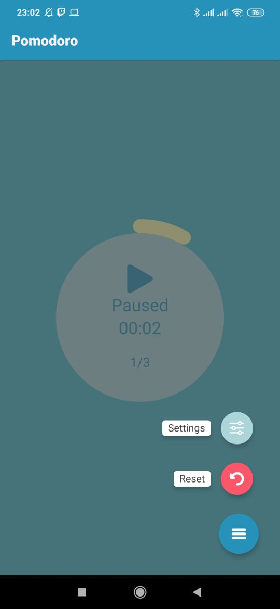
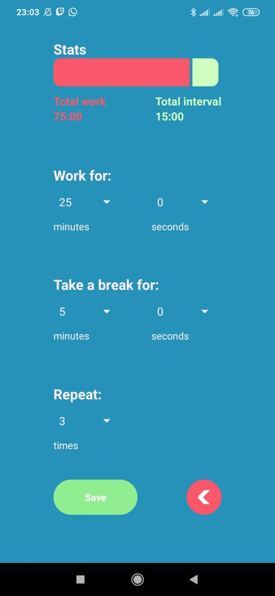
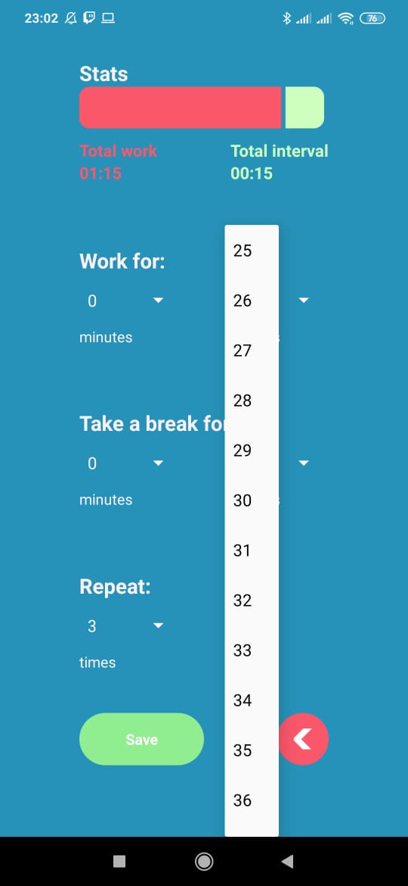
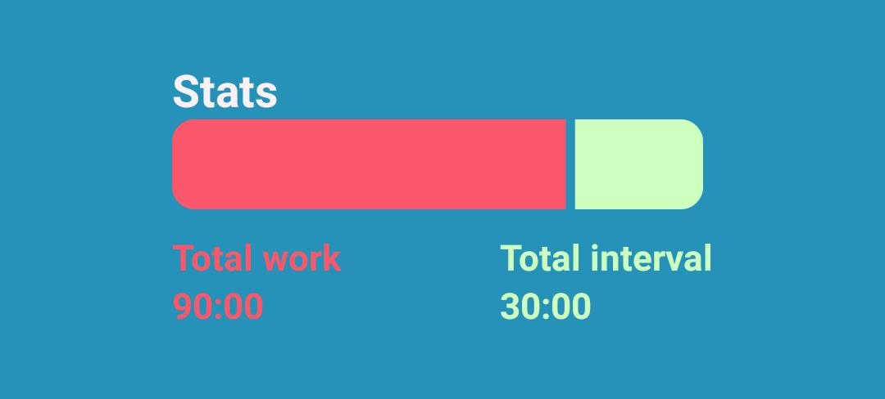

# Pomodoro App

Aplicativo de apoio para realizar atividades utilizando a Técnica pomodoro.

## Técnica Pomodoro

A Técnica Pomodoro é um método de gerenciamento de tempo desenvolvido por
Francesco Cirillo no final dos anos 1980. A técnica usa um cronômetro para dividir o
trabalho em intervalos, tradicionalmente de 25 minutos de duração, separados por
intervalos curtos - 5 minutos.

## Features e Requerimentos

### Temporizador para demonstrar o tempo de duração da atividade e do intervalo

No centro da tela inicial da aplicação o contador indica em formato ***MM:SS*** o tempo decorrido.  
Acima no contador, o texto indica o estado da atividade atual, se é momento de trabalhar ou de dar um intervalo.  
Há também um indicador de séries a serem ainda completadas. Exemplo: se o usuário escolhe 5 séries, o contador irá realizar 5 horários de trabalho e 5 intervalos.

Trabalho | Intervalo
:-:|:-:
|

### Botão para pausar o temporizador

Junto com o indicador de tempo e o texto do temporizador, há um botão play/pause para alternar o estado do contador.  
Após todas as séries serem finalizadas e o contador parar, o mesmo botão também pode ser usado para resetar o contador. 

Pause | Play | Reset
:-:|:-:|:-:
||

### Um botão para zerar o temporizador

O botão para resetar o temporizador se encontra em uma das opções do botão flutuante no canto inferior direito.  
O reset irá restaurar todos os dados atuais do contador para os predefinidos nas configurações.

### Adicionar um gráfico que demonstra a redução do tempo

Ao redor das informações no centro da tela inicial, uma barra acompanha os valores do contador.  
A barra pode assumir três cores, vermelho para acompanhar o horário de trabalho, verde para acompanhar o intervalo, amarela para identificar que o contador esta pausado ou finalizado.

Trabalho | Intervalo | Pausado ou Finalizado
:-:|:-:|:-:
||

### Menu de configuração para o usuário alterar os tempos de duração da atividade  e do intervalo 

Outra opção do botão flutuante na tela principal leva à tela de configurações, onde o usuário pode visualizar estatísticas, configurar minutos e segundos dos tempos de trabalho e de intervalo, além de poder configurar o número de séries a serem realizadas.  
A tela de configurações conta com duas opções na parte inferior, uma salva e aplica as alterações, a outra descarta e retorna à tela inicial.

Botão de Acesso | Tela de configurações | Menu dropdown
:-:|:-:|:-:
||

### Feedback visual para distinguir duração da atividade e duração do intervalo

Na tela de configurações há um gráfico com duas cores, para que o usuário identifique visualmente as proporções de trabalho e intervalo das configurações selecionadas. O tempo de trabalho é identificado pelo vermelho e o de intervalo pelo verde.  
Abaixo há um indicativo da soma total do tempo gasto com cada atividade em todas as séries (se são 10 minutos de intervalo durante 3 séries, o tempo total de intervalo é 30 minutos).

### Adicionar navegação ao aplicativo

A navegação entre as telas foi feita utilizando [React Navigation](https://reactnavigation.org/) é bem simples, já que a aplicação possui apenas duas telas.  
A configuração das rotas pode ser vista no arquivo [Router](src/Router.js), nele são configuradas as rotas e os contextos da aplicação.
